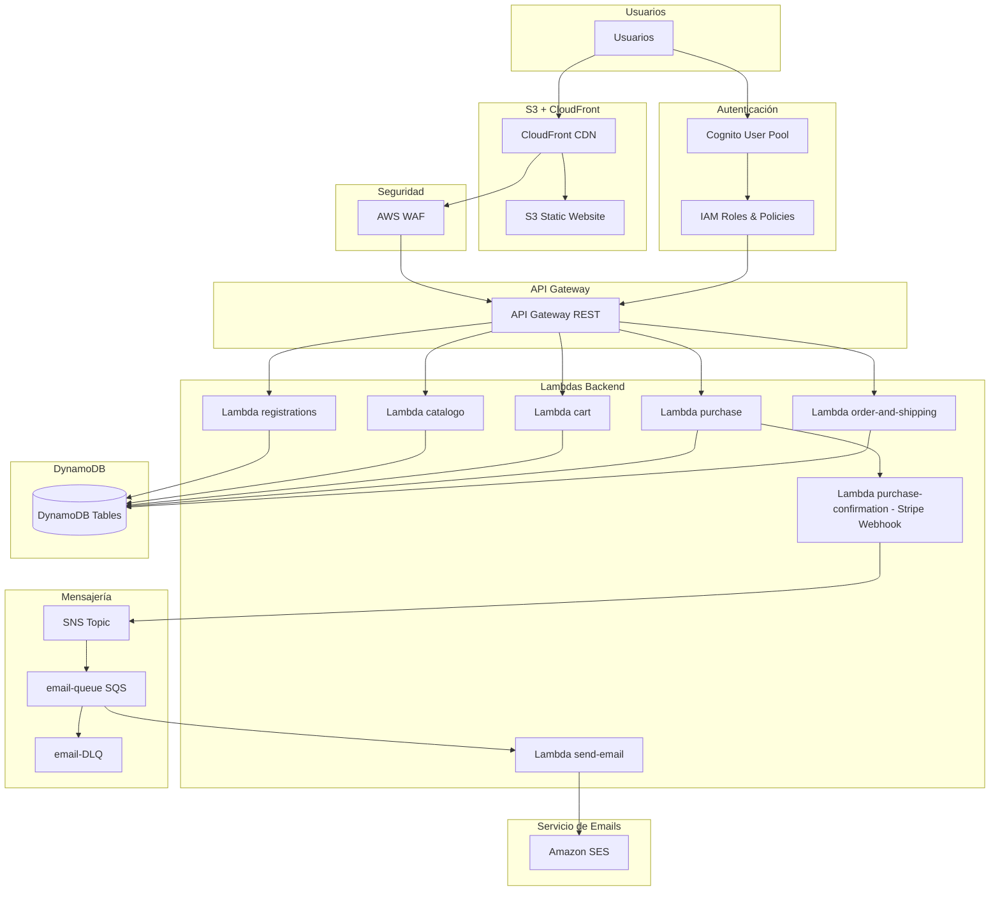

# Proyecto de Infraestructura como Código (IaC) para E-Commerce

Este proyecto implementa la infraestructura completa para una plataforma de E-commerce serverless en AWS. Utiliza Terraform para definir y gestionar todos los recursos en la nube (Infraestructura como Código), un conjunto de microservicios en Node.js para la lógica de negocio, y un pipeline de CI/CD con Jenkins para la automatización del despliegue.

## Arquitectura

La arquitectura está diseñada para ser escalable, segura y desacoplada, siguiendo las mejores prácticas de serverless y microservicios en la nube.



### Componentes Clave

-   **API Gateway**: Actúa como la puerta de entrada única para todas las peticiones del cliente. Enruta las peticiones al microservicio Lambda correspondiente y gestiona la autorización a través de un autorizador de Cognito.
-   **AWS Lambda**: Cada microservicio (`registrations`, `catalogo`, `card`, etc.) se implementa como una función Lambda independiente.
-   **Amazon Cognito**: Gestiona la autenticación y autorización de usuarios. La mayoría de los endpoints de la API están protegidos y requieren un token JWT emitido por Cognito.
-   **DynamoDB**: Es la base de datos principal, de tipo NoSQL. Existen tablas separadas para usuarios, productos, carritos, pedidos, etc.
-   **SQS y SNS**: Se utilizan para la comunicación asíncrona entre servicios. Por ejemplo, cuando se completa una compra, se envía un mensaje a una cola SQS que es procesado por una función Lambda (`send-emails-order`) para notificar al cliente.
-   **S3**: Almacena los artefactos de despliegue (código fuente de las Lambdas en formato .zip).
-   **CloudFront, WAF, VPC**: Proveen seguridad, caché de contenido y aislamiento de red para la infraestructura.

## Microservicios

El backend está descompuesto en los siguientes microservicios:

| Microservicio           | Directorio                | Descripción                                                                                              |
| ----------------------- | ------------------------- | -------------------------------------------------------------------------------------------------------- |
| **Registrations**       | `registrations/`          | Gestiona el registro, confirmación de cuenta e inicio de sesión de usuarios a través de Cognito.          |
| **Catalogue**           | `catalogo/`               | Provee acceso al catálogo de productos almacenado en DynamoDB.                                           |
| **Card**                | `card/`                   | Gestiona las operaciones del carrito de compras (añadir, ver, eliminar productos).                       |
| **Order and Shipping**  | `orderandshipping/`       | Crea y gestiona los pedidos y la información de envío.                                                   |
| **Purchase**            | `purchase/`               | Inicia el flujo de compra.                                                                               |
| **Purchase Confirmation** | `purchase-confirmation/`  | Un endpoint de webhook para recibir la confirmación de pago de un servicio de terceros (ej. Stripe).    |
| **Send Emails Order**   | `send-emails-order/`      | Procesa eventos de una cola SQS para enviar correos electrónicos de confirmación de pedido.              |

## Estructura del Proyecto

```
.
├── card/                    # Código fuente del microservicio de Carrito
├── catalogo/                # Código fuente del microservicio de Catálogo
├── iac/                     # Ficheros de Terraform para la infraestructura
│   ├── main.tf              # Configuración principal del provider de AWS
│   ├── variables.tf         # Variables de Terraform
│   ├── apigateway.tf        # Definición del API Gateway y sus rutas
│   ├── dynamodb.tf          # Definición de las tablas de DynamoDB
│   ├── lambda-*.tf          # Definiciones de las funciones Lambda
│   └── tests/               # Pruebas de integración para Terraform
├── jenkins/                 # Configuración del entorno de Jenkins
│   ├── Dockerfile           # Dockerfile para la imagen de Jenkins
│   ├── docker-compose.yaml  # Orquestación del contenedor de Jenkins
│   └── jcasc/               # Configuración de Jenkins como Código (JCasC)
├── orderandshipping/        # Código fuente del microservicio de Órdenes
├── purchase/                # Código fuente del microservicio de Compras
├── ...                      # Resto de directorios de microservicios
└── JenkinsFile              # Definición del pipeline de CI/CD
```

## Pipeline de CI/CD

El proyecto incluye un `JenkinsFile` que define un pipeline para automatizar la validación y el despliegue de la infraestructura.

**Etapas del Pipeline:**

1.  **Checkout**: Clona el repositorio de código.
2.  **Lint & Validate**: Ejecuta `terraform fmt` y `terraform validate` para asegurar que el código de Terraform esté bien formateado y sea sintácticamente correcto.
3.  **Terraform Plan**: Genera un plan de ejecución (`terraform plan`). Este paso muestra los cambios que se aplicarán a la infraestructura.
4.  **Approval (Rama `main`)**: Si el pipeline se ejecuta en la rama `main`, requiere una aprobación manual antes de proceder con el despliegue. Esto actúa como una salvaguarda para el entorno de producción.
5.  **Terraform Apply**: Aplica los cambios a la infraestructura en AWS (`terraform apply`).

## Prerrequisitos

-   [AWS CLI](https://aws.amazon.com/cli/) con credenciales configuradas.
-   [Terraform](https://www.terraform.io/downloads.html) (versión especificada en `iac/main.tf`).
-   [Docker](https://www.docker.com/get-started) y [Docker Compose](https://docs.docker.com/compose/install/).
-   [Node.js](https://nodejs.org/) y npm para instalar dependencias de los microservicios.

## Despliegue

Existen dos formas de desplegar la infraestructura: a través de Jenkins (recomendado) o manualmente.

### Despliegue con Jenkins (Recomendado)

1.  **Iniciar Jenkins**:
    ```bash
    cd jenkins/
    docker-compose up -d
    ```
    Jenkins estará disponible en `http://localhost:8080`.

2.  **Configurar Pipeline**: El pipeline se configura automáticamente al inicio gracias a JCasC, apuntando al `JenkinsFile` en la raíz del proyecto.

3.  **Ejecutar**: Cualquier `push` a una rama del repositorio disparará la ejecución del pipeline. Para desplegar en el entorno principal, se debe hacer un merge a la rama `main` y aprobar manualmente el despliegue en la UI de Jenkins.

### Despliegue Manual

1.  **Instalar dependencias de los microservicios**:
    Es necesario ejecutar `npm install` dentro del directorio de cada microservicio (ej. `card/`, `catalogo/`, etc.). El pipeline de Terraform empaqueta el código automáticamente, pero las dependencias deben estar presentes.

2.  **Navegar al directorio de IaC**:
    ```bash
    cd iac/
    ```

3.  **Inicializar Terraform**:
    Este comando descarga los providers necesarios.
    ```bash
    terraform init
    ```

4.  **Planificar los cambios**:
    Este comando muestra los recursos que se crearán, modificarán o destruirán.
    ```bash
    terraform plan
    ```

5.  **Aplicar los cambios**:
    Este comando aprovisiona la infraestructura en tu cuenta de AWS.
    ```bash
    terraform apply
    ```

## Pruebas

El proyecto incluye pruebas de integración para la configuración de Terraform. Para ejecutarlas:

1.  **Navegar al directorio de pruebas**:
    ```bash
    cd iac/tests/
    ```

2.  **Inicializar Terraform para pruebas**:
    ```bash
    terraform init
    ```

3.  **Ejecutar las pruebas**:
    ```bash
    terraform test
    ```